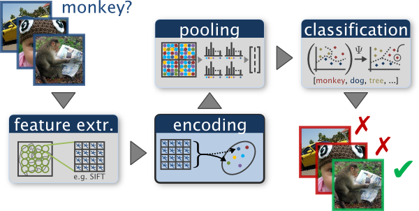
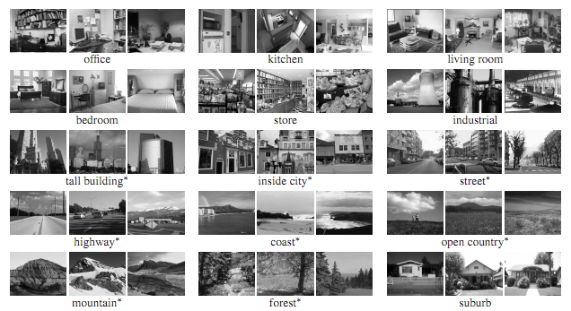

An example of a typical bag of words classification pipeline. Figure by <a href="http://www.robots.ox.ac.uk/~vgg/research/encoding_eval/">Chatfield et al.</a>

<h1>Project 3: Scene recognition with bag of words 
</h1> 

 
<h2>Brief</h2> 

 

<ul> 
  <li>Due date: Nov. 18th, 11:59pm</li> 
  <li><i>Partial</i> You have to download <a href="http://www.vlfeat.org/download.html">VLFeat 0.9.17 binary package</a></li> 
  <li>VL Feat Matlab reference: <a href="http://www.vlfeat.org/matlab/matlab.html">http://www.vlfeat.org/matlab/matlab.html</a> 
  <li>Required files: results/index.md, and code/</li>

</ul>

 
 
<h2>Overview</h2> 

 
The goal of this project is to introduce you to image recognition. Specifically, we will examine the task of scene recognition starting with very simple methods -- tiny images and nearest neighbor classification -- and then move on to techniques that resemble the state-of-the-art -- bags of quantized local features and linear classifiers learned by support vector machines.

Bag of words models are a popular technique for image classification inspired by models used in natural language processing. The model ignores or downplays word arrangement (spatial information in the image) and classifies based on a histogram of the frequency of visual words. The visual word "vocabulary" is established by clustering a large corpus of local features. See Szeliski chapter 14.4.1 for more details on category recognition with quantized features. In addition, 14.3.2 discusses vocabulary creation and 14.1 covers classification techniques. 

For this project you will be implementing a basic bag of words model with many opportunities for extra credit. You will classify scenes into one of 15 categories by training and testing on the 15 scene database (introduced in <a href="http://www.di.ens.fr/willow/pdfs/cvpr06b.pdf">Lazebnik et al. 2006</a>, although built on top of previously published datasets). <a href="http://www.di.ens.fr/willow/pdfs/cvpr06b.pdf">Lazebnik et al. 2006</a> is a great paper to read, although we will be implementing the <i>baseline method</i> the paper discusses (equivalent to the zero level pyramid) and not the more sophisticated spatial pyramid (which is extra credit). For an excellent survey of modern feature encoding methods for bag of words models see <a href="http://www.robots.ox.ac.uk/~vgg/research/encoding_eval/">Chatfield et al, 2011</a>.

Example scenes from of each category in the 15 scene dataset. Figure from <a href="http://www.di.ens.fr/willow/pdfs/cvpr06b.pdf">Lazebnik et al. 2006</a>.

<h2>Details and Starter Code</h2>

The top level script for this project is <code>proj3.m</code>. If you run it unchanged, it will randomly guess the category of every test image and achieve about 7% accuracy by doing so (1 out of 15 guesses are correct). 

You are required to implement 2 different image representations -- tiny images and bags of SIFT features -- and 2 different classification techniques -- nearest neighbor and linear SVM. In the writeup, you are specifically asked to report performance for the following combinations, and it is also highly recommended that you implement them in this order:

<ul>
 <li>Tiny images representation and nearest neighbor classifier (accuracy of about 18-25%).</li>
 <li>Bag of SIFT representation and nearest neighbor classifier (accuracy of about 50-60%).</li>
 <li>Bag of SIFT representation and linear SVM classifier (accuracy of about 60-70%).</li>
</ul>

You will start by implementing the tiny image representation and the nearest neighbor classifier. They are easy to understand, easy to implement, and run very quickly for our experimental setup (less than 10 seconds). 

The "tiny image" feature, inspired by the work of the same name by <a href="http://groups.csail.mit.edu/vision/TinyImages/">Torralba, Fergus, and Freeman</a>, is one of the simplest possible image representations. One simply resizes each image to a small, fixed resolution (we recommend 16x16). It works slightly better if the tiny image is made to have zero mean and unit length. This is not a particularly good representation, because it discards all of the high frequency image content and is not especially shift invariant. <a href="http://groups.csail.mit.edu/vision/TinyImages/">Torralba, Fergus, and Freeman</a> propose several alignment methods to alleviate the latter drawback, but we will not worry about alignment for this project. We are using tiny images simply as a  baseline. See <code>get_tiny_images.m</code> for more details.

The nearest neighbor classifier is equally simple to understand. When tasked with classifying a test feature into a particular category, one simply finds the "nearest" training example (L2 distance is a sufficient metric) and assigns the test case the label of that nearest training example. The nearest neighbor classifier has many desirable features -- it requires no training, it can learn arbitrarily complex decision boundaries, and it trivially supports multiclass problems. It is quite vulnerable to training noise, though, which can be alleviated by voting based on the K nearest neighbors (but you are not required to do so). Nearest neighbor classifiers also suffer as the feature dimensionality increases, because the classifier has no mechanism to learn which dimensions are irrelevant for the decision. See <code>nearest_neighbor_classify.m</code> for more details.

Together, the tiny image representation and nearest neighbor classifier will get about 15% to 25% accuracy on the 15 scene database. For comparison, chance performance is ~7%.

After you have implemented a baseline scene recognition pipeline it is time to move on to a more sophisticated image representation -- bags of quantized SIFT features. Before we can represent our training and testing images as bag of feature histograms, we first need to establish a <i>vocabulary</i> of visual words. We will form this vocabulary by sampling many local features from our training set (10's or 100's of thousands) and then clustering them with kmeans. The number of kmeans clusters is the size of our vocabulary and the size of our features. For example, you might start by clustering many SIFT descriptors into k=50 clusters. This partitions the continuous, 128 dimensional SIFT feature space into 50 regions. For any new SIFT feature we observe, we can figure out which region it belongs to as long as we save the centroids of our original clusters. Those centroids are our visual word vocabulary. Because it can be slow to sample and cluster many local features, the starter code saves the cluster centroids and avoids recomputing them on future runs. See <code>build_vocabulary.m</code> for more details.

Now we are ready to represent our training and testing images as histograms of visual words. For each image we will densely sample many SIFT descriptors. Instead of storing hundreds of SIFT descriptors, we simply count how many SIFT descriptors fall into each cluster in our visual word vocabulary. This is done by finding the nearest neighbor kmeans centroid for every SIFT feature. Thus, if we have a vocabulary of 50 visual words, and we detect 220 SIFT features in an image, our bag of SIFT representation will be a histogram of 50 dimensions where each bin counts how many times a SIFT descriptor was assigned to that cluster and sums to 220. The histogram should be normalized so that image size does not dramatically change the bag of feature magnitude. See <code>get_bags_of_sifts.m</code> for more details.

You should now measure how well your bag of SIFT representation works when paired with a nearest neighbor classifier. There are <i>many</i> design decisions and free parameters for the bag of SIFT representation (number of clusters, sampling density, sampling scales, SIFT parameters, etc.) so performance might vary from 50% to 60% accuracy.

The last task is to train 1-vs-all linear SVMS to operate in the bag of SIFT feature space. Linear classifiers are one of the simplest possible learning models. The feature space is partitioned by a learned hyperplane and test cases are categorized based on which side of that hyperplane they fall on. Despite this model being far less expressive than the nearest neighbor classifier, it will often perform better. For example, maybe in our bag of SIFT representation 40 of the 50 visual words are uninformative. They simply don't help us make a decision about whether an image is a 'forest' or a 'bedroom'. Perhaps they represent smooth patches, gradients, or step edges which occur in all types of scenes. The prediction from a nearest neighbor classifier will still be heavily influenced by these frequent visual words, whereas a linear classifier can learn that those dimensions of the feature vector are less relevant and thus downweight them when making a decision. There are numerous methods to learn linear classifiers but we will find linear decision boundaries with a support vector machine. You do not have to implement the support vector machine. However, linear classifiers are inherently binary and we have a 15-way classification problem. To decide which of 15 categories a test case belongs to, you will train 15 binary, 1-vs-all SVMs. 1-vs-all means that each classifier will be trained to recognize 'forest' vs 'non-forest', 'kitchen' vs 'non-kitchen', etc. All 15 classifiers will be evaluated on each test case and the classifier which is most confidently positive "wins". E.g. if the 'kitchen' classifier returns a score of -0.2 (where 0 is on the decision boundary), and the 'forest' classifier returns a score of -0.3, and all of the other classifiers are even more negative, the test case would be classified as a kitchen even though none of the classifiers put the test case on the positive side of the decision boundary.  When learning an SVM, you have a free parameter 'lambda' which controls how strongly regularized the model is. Your accuracy will be very sensitive to lambda, so be sure to test many values. See <code>svm_classify.m</code> for more details.

Now you can evaluate the bag of SIFT representation paired with 1-vs-all linear SVMs. Accuracy should be from 60% to 70% depending on the parameters. You can do better still if you implement extra credit suggestions below. 

The starter code, starting from <code>proj3.m</code> contains more concrete guidance on the inputs, outputs, and suggested strategies for the five functions you will implement: <code>get_tiny_images.m</code>, <code>nearest_neighbor_classify.m</code>, <code>build_vocabulary.m</code>, <code>get_bags_of_sifts.m</code>, and <code>svm_classify.m</code>. The starter code also contains <code>create_results_webpage.m</code> which you are not required to modify (but you can, if you want to show more images or change the size of the thumbnails). 

<h2>Evaluation and Visualization</h2>

The starter code builds a confusion matrix and visualizes your classification decisions by producing a <a href="https://github.com/NTHU-EE-CV-2014-Fall/homework3/blob/master/results/index.md">table of true positives, false positives, and false negatives as a webpage</a> each time you run <code>proj3.m</code>. 

<h2>Data</h2>

The starter codes trains and tests on 100 images from each category (i.e. 1500 training examples total and 1500 test cases total). In a real research paper, one would be expected to test performance on random splits of the data into training and test sets, but the starter code does not do this to ease debugging.

<h2>Useful Functions</h2>

The starter code contains more complete discussions of useful functions from VL feat. One thing to keep in mind is that while Matlab and the starter code represent points as row vectors, VL feat uses column vectors. Thus you might need to transpose your matrices / vectors frequently.

<a href="http://www.vlfeat.org/matlab/vl_dsift.html"><code>vl_dsift()</code></a>. This function returns SIFT descriptors sampled at a regular step size from an image. You are allowed to use this function because you have already implemented the SIFT descriptor in project 2. You can use your own code if you want, but it is probably too slow. 

<a href="http://www.vlfeat.org/matlab/vl_kmeans.html"><code>vl_kmeans()</code></a>. This function performs kmeans clustering and you can use it when building the bag of SIFT vocabulary. Matlab also has a built in kmeans function, but it is slow.

<a href="http://www.vlfeat.org/matlab/vl_svmtrain.html"><code>vl_svmtrain()</code></a>. This function returns the parameters of a linear decision boundary (a hyperplane in your feature space). You will use the distance from this hyperplane as a measure of confidence in your 1-vs-all classifier.

<a href="http://www.vlfeat.org/matlab/vl_alldist2.html"><code>vl_alldist2()</code></a>. This function returns all pairs of distances between the columns of two matrices. This is useful in your nearest neighbor classifier and when assigning SIFT features to the nearest cluster center. You can use this function because you have already written a similar distance computation as part of the project 2 matching step and this function will be much faster.

<h2>Write up</h2> 
For this project, and all other projects, you must do a project report in [Markdown](https://help.github.com/articles/markdown-basics). We provide you with a placeholder [index.md](./results/index.md) document which you can edit. In the report you will describe your algorithm and any decisions you made to write your algorithm a particular way. Discuss any extra credit you did and show what contribution it had on the results (e.g. performance with and without each extra credit component).

You are required to report the accuracy you achieved for the three recognition pipelines above (tiny images + nearest neighbor, bag of SIFT + nearest neighbor, and bag of SIFT + 1 vs all linear SVM). The accuracy number reported by the starter code -- the average of the diagonal of the confusion matrix -- will suffice. However, for your best performing recognition setup you should include the <a href="https://github.com/NTHU-EE-CV-2014-Fall/homework3/blob/master/results/index.md">full confusion matrix and the table of classifier results produced by the starter code</a>. Simply copy the html and images into your writeup.

<h2>Extra Credit</h2> 

For all extra credit, be sure to include quantitative analysis showing the impact of the particular method you've implemented.  Each item is "up to" some amount of points because trivial implementations may not be worthy of full extra credit. Most of the extra credit focuses on the final bag of words + SVM pipeline of the project, not the baseline tiny image and nearest neighbor methods.

Feature representation extra credit:

<ul>
<li>up to 3 pts: Experiment with features at multiple scales. E.g. sampling features from different levels of a Gaussian pyramid.</li>
  <li>up to 5 pts: Add additional, complementary features (e.g.  <a href="http://people.csail.mit.edu/torralba/code/spatialenvelope/">gist descriptors</a> and <a href="http://www.robots.ox.ac.uk/~vgg/software/SelfSimilarity/">self-similarity descriptors</a>) and have the classifier consider them all.</li>
</ul>

Feature quantization and bag of words extra credit:

<ul>
<li>up to 3 pts: Add spatial information to your features by creating a (possibly overlapping) grid of visual word histograms over the image. This is the "Single-level" regime described by <a href="http://www.cs.unc.edu/~lazebnik/publications/cvpr06b.pdf">Lazebnik et al 2006</a>.</li>
<li>up to 3 pts: Use "soft assignment" to assign visual words to histogram bins. Each visual word will cast a distance-weighted vote to multiple bins. This is called "kernel codebook encoding" by <a href="http://www.robots.ox.ac.uk/~vgg/research/encoding_eval/">Chatfield et al.</a>.</li>
  <li>up to 5 pts: Use one of the more sophisticated feature encoding schemes analyzed in the comparative study of <a href="http://www.robots.ox.ac.uk/~vgg/research/encoding_eval/">Chatfield et al.</a> (Fisher, Super Vector, or LLC). VL feat offers two helpful functions for Fisher encoding: <code>vl_gmm</code> and <code>vl_fisher</code>.</li>
</ul>

Classifier extra credit:

<ul>
<li>up to 3 pts: Train the SVM with more sophisticated kernels such as Gaussian/RBF, L1, or chi-sqr. You will need to use a different SVM package than VL feat's linear SVM. <a href="http://olivier.chapelle.cc/primal/">Olivier Chapelle's MATLAB code</a> works well.</li>
<li>up to 5 pts: Try and improve the nearest neighbor classifier to be competitive or better than the linear SVM using the method of <a href="http://grail.cs.washington.edu/pub/pages/Boiman2008IDO.html">Boiman, Schechtman, and Irani, CVPR 2008</a>.
</li></ul>

Spatial Pyramid representation and classifier:

<ul>
<li>up to 5 pts: Add spatial information to your features by implementing the spatial pyramid and pyramid match kernel described in <a href="http://www.cs.unc.edu/~lazebnik/publications/cvpr06b.pdf">Lazebnik et al 2006</a>.</li>
</ul>

Experimental design extra credit:

<ul>
<li>up to 3 pts: Use cross-validation to measure performance rather than the fixed test / train split provided by the starter code. Randomly pick 100 training and 100 testing images for each iteration and report average performance and standard deviations.</li>
  <li>up to 3 pts: Add a validation set to your training process to tune learning parameters. This validation set could either be a subset of the training set or some of the otherwise unused test set.</li>
  <li>up to 3 pts: Experiment with many different vocabulary sizes and report performance. E.g. 10, 20, 50, 100, 200, 400, 1000, 10000.</li>
  <li>up to 5 pts: Report performance on the 397-category <a href="http://groups.csail.mit.edu/vision/SUN/">SUN database</a>. This involves more than 100x as many training and testing examples as the base project, so it is not trivial to do.</li>
</ul>

Github related extra credit:

* +2 pts: If you make your code publicly available.
* +2 pts: If you comment on pull request from students who fork the homework. Make sure you send me a screenshot of the comments to me.

Finally, there will be extra credit and recognition for the student who achieves the highest recognition rate. 
 
<h2> Handing in </h2> 

* Publicly fork version (+2 extra points)
	- [Fork the homework](https://education.github.com/guide/forks) to obtain a copy of the homework in your github account
	- [Clone the homework](http://gitref.org/creating/#clone) to your local space and work on the code locally
	- Commit and push your local code to your github repo
	- Once you are done, submit your homework by [creating a pull request](https://help.github.com/articles/creating-a-pull-request)

* [Privately duplicated version](https://help.github.com/articles/duplicating-a-repository)
  - Make a bare clone
  - mirror-push to new repo
  - [make new repo private](https://help.github.com/articles/making-a-private-repository-public)
  - [add aliensunmin as collaborator](https://help.github.com/articles/adding-collaborators-to-a-personal-repository)
  - [Clone the homework](http://gitref.org/creating/#clone) to your local space and work on the code locally
  - Commit and push your local code to your github repo
  - I will clone your repo after the due date
 
<h2> Rubric </h2> 
<ul> 
<li> +10 pts: Build tiny image features for scene recognition. (<code>get_tiny_images.m</code>)</li>
<li> +10 pts: Nearest neighbor classifier. (<code>nn_classify.m</code>)</li>
   <li> +20 pts: Build a vocabulary from a random set of training features. (<code>build_vocabulary.m</code>)</li>
   <li> +20 pts: Build histograms of visual words for training and testing images. (<code>get_bags_of_sifts.m</code>)</li>
   <li> +20 pts: Train 1-vs-all SVMs on your bag of words model. (<code>svm_classify.m</code></li>
   <li> +20 pts: Writeup with design decisions and evaluation.</li>
   <li> +20 pts: Extra credit (up to <del>ten</del>twenty points) </li>
   <li> -5*n pts: Lose 5 points for every time (after the first) you do not follow the instructions for the hand in format </li> 
</ul> 
 
<h2> Final Advice </h2> 

 
Extracting features, clustering to build a universal dictionary, and building histograms from features can be slow. A good implementation can run the entire pipeline in less than 10 minutes, but this may be at the expense of accuracy (e.g. too  small a vocabulary of visual words or too sparse a sampling rate). Save intermediate results and/or make use of Matlab's <a href="http://www.mathworks.com/help/matlab/matlab_prog/run-sections-of-programs.html">code sections</a> functionality if you are trying to fine tune one part of the pipeline.

 

<h2> Credits </h2> 

Assignment modified by Min Sun based on project description and code by James Hays and Sam Birch. Figures in this handout from <a href="http://www.robots.ox.ac.uk/~vgg/research/encoding_eval/">Chatfield et al.</a> and <a href="http://www.cs.illinois.edu/homes/slazebni/">Lana Lazebnik</a>.

 
