# Meng-Jiun Chiou (邱盟竣) <span style="color:red">NCTU</span>

# Project 3 / Scene recognition with bag of words

## Overview
The project is related to the whole process of image classification. It required to implement all of the process, including feature representation and classiication.

## Implementation
There're actually five `.m` file should be completed in this project, which are `get_tiny_images.m`, `nearest_neighbor_classify.m`, `build_vocabulary.m`, `get_bags_of_sifts.m`, and `svm_classify.m`.

- **Using tiny images as feature representation**

With [VLFeat](http://www.vlfeat.org/), one can easily extract SIFT from any image. In my implementation I used Matlab interface of VLFeat to get the descriptors. To build a tiny image feature, simply resize the original image to a very small square resolution, e.g. 16x16. 

In my `get_tiny_images.m`, mainly codes like below:
```
image_feats = [];
length = 16;

for i = 1:size(image_paths)
    img = imread(image_paths{i, 1});
    img = imresize(img, [length length]);
    
    new_img = [];
    for j = 1:length
        new_img = [new_img, img(j, :)];
    end
    
    new_img = double(new_img);
    new_img = new_img ./ sum(new_img);
    new_img = new_img - mean(new_img);
    
    image_feats = [image_feats; new_img];
end
```
note that new_img vectors are normalized as unit length and zero mean.

- **Classifying by the Nearest Neighbor**

One of the easiest way to dealing with classification problem is by nearest neighbor approach. Just find the **nearest** training pictures of testing pictures. However, this approach is easily affected by noises.

In my `nearest_neighbor_classify.m`, mainly codes like below:
```
dist = vl_alldist2(train_image_feats', test_image_feats');
dist = dist';

predicted_categories = [];
for i = 1:size(test_image_feats,1)
    [Y, I] = min(dist(i, :));
    label = train_labels(I, 1);
    predicted_categories = [predicted_categories; label];
end
```

- **Turning to better method: SIFT and Bag-Of-Features**

Beyond the easily but worse-performance approaches like tiny pictures, one more popular and much better approach of feature representation is the combination of SIFT and Bag-of-Features. To implement, one should firstly build an **vocabulary dictionary**, which is essentially visual words clusters. 

In my `build_vocabulary.m` file, 
```
step = 15;
bin_size = 8;
features = [];

for i = 1:length(image_paths)
    img = single( imread(image_paths{i}) );
    if size(img, 3) > 1
        img =rgb2gray(img);
    end
    [locations, SIFT_features] = vl_dsift(img, 'fast', 'step', step, 'size', bin_size);
    features = [features, SIFT_features];
end

[centers, assignments] = vl_kmeans(double(features), vocab_size)
vocab = centers';
```
note that one could choose different parameters (step, bin_size, etc.) to optimize the result.

Next, assign the nearest visual word to each SIFT features, and then obtain the histogram representation of each picture.
In my `get_bags_of_sifts.m` file, 
```
for i = 1:length(image_paths)
    img = single( imread(image_paths{i}) );
    if size(img, 3) > 1
        img =rgb2gray(img);
    end
    
    [locations, SIFT_features] = vl_dsift(img, 'step', step, 'size', bin_size);
    
    [index , dist] = vl_kdtreequery(forest , vocab' , double(SIFT_features));
    
    feature_hist = hist(double(index), vocab_size);
    feature_hist = feature_hist ./ sum(feature_hist);
    % feature_hist = feature_hist ./ norm(feature_hist);
    
    image_feats(i, :) = feature_hist;
end
```

- **Classification with Support Vector Machine**

One of the most popular and high-accuracy approach of classification is Support Vector Machine (SVM). Linear SVM can be good when applied to data which are of high dimension. 

In my `svm_classiy.m` file, I first construct the labels of all training data:
```
for i = 1:num_categories
    matching_indices = strcmp(categories(i) , train_labels);
    matching_indices = double(matching_indices);
    for j = 1: size(train_labels, 1)
        if(matching_indices(j) == 0)
            matching_indices(j) = -1;
        end
    end
```
then, train a linear SVM classifier with `vl_svmtrain()` and record scores:
```
[w, b] = vl_svmtrain(train_image_feats', matching_indices, lambda);
scores = [scores; (w' * test_image_feats' + b) ];
```
Finally, pick the highest scores (even smaller than zero, it's fine):
```
% get maximum scores
[max_values, max_indices] = max(scores);
predicted_categories = categories(max_indices');
```

In addition, I also implement **non-linear SVM (RBF kernel)** with prestigious library `LibSVM`. I make it automated-tuning with parameters *C* and *gamma*. In my `libsvm_classify.m`:
```
addpath('~/lib/libsvm-316');
addpath('~/lib/libsvm-316/matlab')

% grid of parameters
folds = 5;
[C,gamma] = meshgrid(-5:2:15, -15:2:3);

% grid search, and cross-validation
cv_acc = zeros(numel(C),1);
for i=1:numel(C)
    cv_acc(i) = svmtrain(total_matching_indices, train_image_feats, sprintf('-c %f -g %f -v %d', 2^C(i), 2^gamma(i), folds));
end

% pair (C,gamma) with best accuracy
[~,idx] = max(cv_acc);

% train model using best_C and best_gamma
best_C = 2^C(idx);
best_gamma = 2^gamma(idx);

SVM = svmtrain(total_matching_indices, train_image_feats, sprintf('-c %f -g %f', 2^C(i), 2^gamma(i)));
% total_matching_indices ~= test_image_labels as using 100 pics per class orderly
[predicted_label, acc, dic_value] = svmpredict(total_matching_indices, test_image_feats, SVM);
fprintf('Best C = 2^%d, Best gamma = 2^%d\n', C(idx), gamma(idx));

predicted_categories = categories(predicted_label);
```

## Installation
Download the repository, open your matlab and change the work folder to `homework3/code`. Then, set images path of `homework3/data`.

Finally, click *Run*!

### Results

<center>
<h1>Tiny images representation and nearest neighbor classifier</h1>


<br>
Accuracy (mean of diagonal of confusion matrix) is 0.201
<p>

<table border=0 cellpadding=4 cellspacing=1>
<tr>
<th>Category name</th>
<th>Accuracy</th>
<th colspan=2>Sample training images</th>
<th colspan=2>Sample true positives</th>
<th colspan=2>False positives with true label</th>
<th colspan=2>False negatives with wrong predicted label</th>
</tr>
<tr>
<td>Kitchen</td>
<td>0.060</td>
<td bgcolor=LightBlue></td>
<td bgcolor=LightBlue></td>
<td bgcolor=LightGreen></td>
<td bgcolor=LightGreen></td>
<td bgcolor=LightCoral><br><small>Office</small></td>
<td bgcolor=LightCoral><br><small>InsideCity</small></td>
<td bgcolor=#FFBB55><br><small>Highway</small></td>
<td bgcolor=#FFBB55><br><small>TallBuilding</small></td>
</tr>
<tr>
<td>Store</td>
<td>0.010</td>
<td bgcolor=LightBlue></td>
<td bgcolor=LightBlue></td>
<td bgcolor=LightGreen>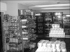</td>
<td bgcolor=LightGreen></td>
<td bgcolor=LightCoral><br><small>Office</small></td>
<td bgcolor=LightCoral><br><small>Industrial</small></td>
<td bgcolor=#FFBB55><br><small>Coast</small></td>
<td bgcolor=#FFBB55><br><small>Coast</small></td>
</tr>
<tr>
<td>Bedroom</td>
<td>0.130</td>
<td bgcolor=LightBlue></td>
<td bgcolor=LightBlue></td>
<td bgcolor=LightGreen></td>
<td bgcolor=LightGreen></td>
<td bgcolor=LightCoral><br><small>Office</small></td>
<td bgcolor=LightCoral><br><small>Industrial</small></td>
<td bgcolor=#FFBB55><br><small>Mountain</small></td>
<td bgcolor=#FFBB55>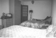<br><small>OpenCountry</small></td>
</tr>
<tr>
<td>LivingRoom</td>
<td>0.060</td>
<td bgcolor=LightBlue></td>
<td bgcolor=LightBlue></td>
<td bgcolor=LightGreen></td>
<td bgcolor=LightGreen></td>
<td bgcolor=LightCoral><br><small>Store</small></td>
<td bgcolor=LightCoral><br><small>Industrial</small></td>
<td bgcolor=#FFBB55><br><small>Street</small></td>
<td bgcolor=#FFBB55><br><small>Coast</small></td>
</tr>
<tr>
<td>Office</td>
<td>0.070</td>
<td bgcolor=LightBlue></td>
<td bgcolor=LightBlue></td>
<td bgcolor=LightGreen></td>
<td bgcolor=LightGreen></td>
<td bgcolor=LightCoral><br><small>Kitchen</small></td>
<td bgcolor=LightCoral>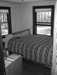<br><small>Bedroom</small></td>
<td bgcolor=#FFBB55><br><small>Forest</small></td>
<td bgcolor=#FFBB55><br><small>Kitchen</small></td>
</tr>
<tr>
<td>Industrial</td>
<td>0.030</td>
<td bgcolor=LightBlue></td>
<td bgcolor=LightBlue></td>
<td bgcolor=LightGreen></td>
<td bgcolor=LightGreen></td>
<td bgcolor=LightCoral><br><small>Suburb</small></td>
<td bgcolor=LightCoral>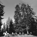<br><small>Forest</small></td>
<td bgcolor=#FFBB55><br><small>Coast</small></td>
<td bgcolor=#FFBB55><br><small>TallBuilding</small></td>
</tr>
<tr>
<td>Suburb</td>
<td>0.220</td>
<td bgcolor=LightBlue></td>
<td bgcolor=LightBlue></td>
<td bgcolor=LightGreen></td>
<td bgcolor=LightGreen></td>
<td bgcolor=LightCoral><br><small>Street</small></td>
<td bgcolor=LightCoral><br><small>Store</small></td>
<td bgcolor=#FFBB55><br><small>Street</small></td>
<td bgcolor=#FFBB55><br><small>Street</small></td>
</tr>
<tr>
<td>InsideCity</td>
<td>0.070</td>
<td bgcolor=LightBlue></td>
<td bgcolor=LightBlue></td>
<td bgcolor=LightGreen></td>
<td bgcolor=LightGreen></td>
<td bgcolor=LightCoral><br><small>Bedroom</small></td>
<td bgcolor=LightCoral><br><small>Mountain</small></td>
<td bgcolor=#FFBB55><br><small>Mountain</small></td>
<td bgcolor=#FFBB55><br><small>Forest</small></td>
</tr>
<tr>
<td>TallBuilding</td>
<td>0.170</td>
<td bgcolor=LightBlue></td>
<td bgcolor=LightBlue></td>
<td bgcolor=LightGreen></td>
<td bgcolor=LightGreen></td>
<td bgcolor=LightCoral><br><small>Industrial</small></td>
<td bgcolor=LightCoral><br><small>Industrial</small></td>
<td bgcolor=#FFBB55><br><small>Highway</small></td>
<td bgcolor=#FFBB55><br><small>LivingRoom</small></td>
</tr>
<tr>
<td>Street</td>
<td>0.380</td>
<td bgcolor=LightBlue></td>
<td bgcolor=LightBlue></td>
<td bgcolor=LightGreen></td>
<td bgcolor=LightGreen></td>
<td bgcolor=LightCoral>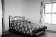<br><small>Bedroom</small></td>
<td bgcolor=LightCoral><br><small>LivingRoom</small></td>
<td bgcolor=#FFBB55><br><small>Highway</small></td>
<td bgcolor=#FFBB55><br><small>Highway</small></td>
</tr>
<tr>
<td>Highway</td>
<td>0.580</td>
<td bgcolor=LightBlue></td>
<td bgcolor=LightBlue></td>
<td bgcolor=LightGreen></td>
<td bgcolor=LightGreen></td>
<td bgcolor=LightCoral>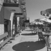<br><small>Street</small></td>
<td bgcolor=LightCoral>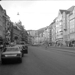<br><small>Street</small></td>
<td bgcolor=#FFBB55><br><small>Coast</small></td>
<td bgcolor=#FFBB55><br><small>OpenCountry</small></td>
</tr>
<tr>
<td>OpenCountry</td>
<td>0.380</td>
<td bgcolor=LightBlue></td>
<td bgcolor=LightBlue></td>
<td bgcolor=LightGreen></td>
<td bgcolor=LightGreen></td>
<td bgcolor=LightCoral><br><small>Highway</small></td>
<td bgcolor=LightCoral>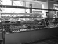<br><small>Store</small></td>
<td bgcolor=#FFBB55><br><small>Highway</small></td>
<td bgcolor=#FFBB55><br><small>Highway</small></td>
</tr>
<tr>
<td>Coast</td>
<td>0.470</td>
<td bgcolor=LightBlue></td>
<td bgcolor=LightBlue></td>
<td bgcolor=LightGreen></td>
<td bgcolor=LightGreen></td>
<td bgcolor=LightCoral><br><small>Store</small></td>
<td bgcolor=LightCoral><br><small>Highway</small></td>
<td bgcolor=#FFBB55><br><small>Industrial</small></td>
<td bgcolor=#FFBB55><br><small>Highway</small></td>
</tr>
<tr>
<td>Mountain</td>
<td>0.180</td>
<td bgcolor=LightBlue></td>
<td bgcolor=LightBlue></td>
<td bgcolor=LightGreen></td>
<td bgcolor=LightGreen></td>
<td bgcolor=LightCoral><br><small>Store</small></td>
<td bgcolor=LightCoral><br><small>Office</small></td>
<td bgcolor=#FFBB55><br><small>Coast</small></td>
<td bgcolor=#FFBB55><br><small>Coast</small></td>
</tr>
<tr>
<td>Forest</td>
<td>0.200</td>
<td bgcolor=LightBlue></td>
<td bgcolor=LightBlue></td>
<td bgcolor=LightGreen></td>
<td bgcolor=LightGreen></td>
<td bgcolor=LightCoral><br><small>Store</small></td>
<td bgcolor=LightCoral><br><small>LivingRoom</small></td>
<td bgcolor=#FFBB55><br><small>Coast</small></td>
<td bgcolor=#FFBB55><br><small>Coast</small></td>
</tr>
<tr>
<th>Category name</th>
<th>Accuracy</th>
<th colspan=2>Sample training images</th>
<th colspan=2>Sample true positives</th>
<th colspan=2>False positives with true label</th>
<th colspan=2>False negatives with wrong predicted label</th>
</tr>
</table>
</center>

<center>
<h1>Bag of SIFT representation and nearest neighbor classifier</h1>


<br>
Accuracy (mean of diagonal of confusion matrix) is 0.463
<p>

<table border=0 cellpadding=4 cellspacing=1>
<tr>
<th>Category name</th>
<th>Accuracy</th>
<th colspan=2>Sample training images</th>
<th colspan=2>Sample true positives</th>
<th colspan=2>False positives with true label</th>
<th colspan=2>False negatives with wrong predicted label</th>
</tr>
<tr>
<td>Kitchen</td>
<td>0.360</td>
<td bgcolor=LightBlue></td>
<td bgcolor=LightBlue></td>
<td bgcolor=LightGreen></td>
<td bgcolor=LightGreen></td>
<td bgcolor=LightCoral><br><small>Office</small></td>
<td bgcolor=LightCoral><br><small>InsideCity</small></td>
<td bgcolor=#FFBB55><br><small>Office</small></td>
<td bgcolor=#FFBB55><br><small>Store</small></td>
</tr>
<tr>
<td>Store</td>
<td>0.400</td>
<td bgcolor=LightBlue></td>
<td bgcolor=LightBlue></td>
<td bgcolor=LightGreen></td>
<td bgcolor=LightGreen></td>
<td bgcolor=LightCoral><br><small>InsideCity</small></td>
<td bgcolor=LightCoral><br><small>TallBuilding</small></td>
<td bgcolor=#FFBB55><br><small>Suburb</small></td>
<td bgcolor=#FFBB55><br><small>Suburb</small></td>
</tr>
<tr>
<td>Bedroom</td>
<td>0.120</td>
<td bgcolor=LightBlue></td>
<td bgcolor=LightBlue></td>
<td bgcolor=LightGreen></td>
<td bgcolor=LightGreen></td>
<td bgcolor=LightCoral>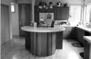<br><small>Kitchen</small></td>
<td bgcolor=LightCoral><br><small>TallBuilding</small></td>
<td bgcolor=#FFBB55><br><small>Kitchen</small></td>
<td bgcolor=#FFBB55><br><small>InsideCity</small></td>
</tr>
<tr>
<td>LivingRoom</td>
<td>0.270</td>
<td bgcolor=LightBlue></td>
<td bgcolor=LightBlue></td>
<td bgcolor=LightGreen></td>
<td bgcolor=LightGreen></td>
<td bgcolor=LightCoral><br><small>Coast</small></td>
<td bgcolor=LightCoral><br><small>Bedroom</small></td>
<td bgcolor=#FFBB55><br><small>InsideCity</small></td>
<td bgcolor=#FFBB55><br><small>Office</small></td>
</tr>
<tr>
<td>Office</td>
<td>0.700</td>
<td bgcolor=LightBlue></td>
<td bgcolor=LightBlue></td>
<td bgcolor=LightGreen></td>
<td bgcolor=LightGreen></td>
<td bgcolor=LightCoral><br><small>LivingRoom</small></td>
<td bgcolor=LightCoral><br><small>Bedroom</small></td>
<td bgcolor=#FFBB55><br><small>Kitchen</small></td>
<td bgcolor=#FFBB55><br><small>Kitchen</small></td>
</tr>
<tr>
<td>Industrial</td>
<td>0.310</td>
<td bgcolor=LightBlue>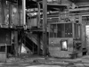</td>
<td bgcolor=LightBlue></td>
<td bgcolor=LightGreen></td>
<td bgcolor=LightGreen></td>
<td bgcolor=LightCoral><br><small>Street</small></td>
<td bgcolor=LightCoral><br><small>TallBuilding</small></td>
<td bgcolor=#FFBB55><br><small>Store</small></td>
<td bgcolor=#FFBB55><br><small>Street</small></td>
</tr>
<tr>
<td>Suburb</td>
<td>0.850</td>
<td bgcolor=LightBlue></td>
<td bgcolor=LightBlue></td>
<td bgcolor=LightGreen></td>
<td bgcolor=LightGreen></td>
<td bgcolor=LightCoral><br><small>Coast</small></td>
<td bgcolor=LightCoral><br><small>OpenCountry</small></td>
<td bgcolor=#FFBB55><br><small>Store</small></td>
<td bgcolor=#FFBB55><br><small>InsideCity</small></td>
</tr>
<tr>
<td>InsideCity</td>
<td>0.270</td>
<td bgcolor=LightBlue></td>
<td bgcolor=LightBlue></td>
<td bgcolor=LightGreen></td>
<td bgcolor=LightGreen></td>
<td bgcolor=LightCoral><br><small>Bedroom</small></td>
<td bgcolor=LightCoral><br><small>TallBuilding</small></td>
<td bgcolor=#FFBB55><br><small>Store</small></td>
<td bgcolor=#FFBB55><br><small>Industrial</small></td>
</tr>
<tr>
<td>TallBuilding</td>
<td>0.360</td>
<td bgcolor=LightBlue></td>
<td bgcolor=LightBlue></td>
<td bgcolor=LightGreen></td>
<td bgcolor=LightGreen></td>
<td bgcolor=LightCoral><br><small>LivingRoom</small></td>
<td bgcolor=LightCoral><br><small>Bedroom</small></td>
<td bgcolor=#FFBB55><br><small>Bedroom</small></td>
<td bgcolor=#FFBB55><br><small>Industrial</small></td>
</tr>
<tr>
<td>Street</td>
<td>0.500</td>
<td bgcolor=LightBlue></td>
<td bgcolor=LightBlue></td>
<td bgcolor=LightGreen></td>
<td bgcolor=LightGreen></td>
<td bgcolor=LightCoral><br><small>Bedroom</small></td>
<td bgcolor=LightCoral><br><small>InsideCity</small></td>
<td bgcolor=#FFBB55><br><small>Industrial</small></td>
<td bgcolor=#FFBB55><br><small>Industrial</small></td>
</tr>
<tr>
<td>Highway</td>
<td>0.750</td>
<td bgcolor=LightBlue></td>
<td bgcolor=LightBlue></td>
<td bgcolor=LightGreen></td>
<td bgcolor=LightGreen></td>
<td bgcolor=LightCoral><br><small>Coast</small></td>
<td bgcolor=LightCoral><br><small>Mountain</small></td>
<td bgcolor=#FFBB55><br><small>Kitchen</small></td>
<td bgcolor=#FFBB55><br><small>Street</small></td>
</tr>
<tr>
<td>OpenCountry</td>
<td>0.360</td>
<td bgcolor=LightBlue></td>
<td bgcolor=LightBlue></td>
<td bgcolor=LightGreen></td>
<td bgcolor=LightGreen>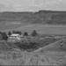</td>
<td bgcolor=LightCoral><br><small>Coast</small></td>
<td bgcolor=LightCoral><br><small>Industrial</small></td>
<td bgcolor=#FFBB55><br><small>Suburb</small></td>
<td bgcolor=#FFBB55>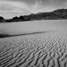<br><small>Mountain</small></td>
</tr>
<tr>
<td>Coast</td>
<td>0.350</td>
<td bgcolor=LightBlue></td>
<td bgcolor=LightBlue></td>
<td bgcolor=LightGreen></td>
<td bgcolor=LightGreen></td>
<td bgcolor=LightCoral><br><small>Industrial</small></td>
<td bgcolor=LightCoral><br><small>OpenCountry</small></td>
<td bgcolor=#FFBB55><br><small>Suburb</small></td>
<td bgcolor=#FFBB55><br><small>OpenCountry</small></td>
</tr>
<tr>
<td>Mountain</td>
<td>0.460</td>
<td bgcolor=LightBlue></td>
<td bgcolor=LightBlue></td>
<td bgcolor=LightGreen></td>
<td bgcolor=LightGreen></td>
<td bgcolor=LightCoral><br><small>Highway</small></td>
<td bgcolor=LightCoral><br><small>Highway</small></td>
<td bgcolor=#FFBB55><br><small>Suburb</small></td>
<td bgcolor=#FFBB55><br><small>Forest</small></td>
</tr>
<tr>
<td>Forest</td>
<td>0.890</td>
<td bgcolor=LightBlue></td>
<td bgcolor=LightBlue></td>
<td bgcolor=LightGreen></td>
<td bgcolor=LightGreen>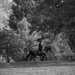</td>
<td bgcolor=LightCoral><br><small>Coast</small></td>
<td bgcolor=LightCoral><br><small>Mountain</small></td>
<td bgcolor=#FFBB55><br><small>Suburb</small></td>
<td bgcolor=#FFBB55><br><small>Suburb</small></td>
</tr>
<tr>
<th>Category name</th>
<th>Accuracy</th>
<th colspan=2>Sample training images</th>
<th colspan=2>Sample true positives</th>
<th colspan=2>False positives with true label</th>
<th colspan=2>False negatives with wrong predicted label</th>
</tr>
</table>
</center>

<center>
<h1>Bag of SIFT representation and linear SVM classifier</h1>


<br>
Accuracy (mean of diagonal of confusion matrix) is 0.614
<p>

<table border=0 cellpadding=4 cellspacing=1>
<tr>
<th>Category name</th>
<th>Accuracy</th>
<th colspan=2>Sample training images</th>
<th colspan=2>Sample true positives</th>
<th colspan=2>False positives with true label</th>
<th colspan=2>False negatives with wrong predicted label</th>
</tr>
<tr>
<td>Kitchen</td>
<td>0.570</td>
<td bgcolor=LightBlue></td>
<td bgcolor=LightBlue></td>
<td bgcolor=LightGreen></td>
<td bgcolor=LightGreen>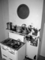</td>
<td bgcolor=LightCoral><br><small>LivingRoom</small></td>
<td bgcolor=LightCoral><br><small>Bedroom</small></td>
<td bgcolor=#FFBB55><br><small>Bedroom</small></td>
<td bgcolor=#FFBB55><br><small>Office</small></td>
</tr>
<tr>
<td>Store</td>
<td>0.440</td>
<td bgcolor=LightBlue></td>
<td bgcolor=LightBlue></td>
<td bgcolor=LightGreen></td>
<td bgcolor=LightGreen></td>
<td bgcolor=LightCoral><br><small>InsideCity</small></td>
<td bgcolor=LightCoral><br><small>LivingRoom</small></td>
<td bgcolor=#FFBB55><br><small>Forest</small></td>
<td bgcolor=#FFBB55><br><small>Mountain</small></td>
</tr>
<tr>
<td>Bedroom</td>
<td>0.350</td>
<td bgcolor=LightBlue></td>
<td bgcolor=LightBlue></td>
<td bgcolor=LightGreen></td>
<td bgcolor=LightGreen></td>
<td bgcolor=LightCoral><br><small>Street</small></td>
<td bgcolor=LightCoral><br><small>Kitchen</small></td>
<td bgcolor=#FFBB55>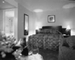<br><small>TallBuilding</small></td>
<td bgcolor=#FFBB55><br><small>Store</small></td>
</tr>
<tr>
<td>LivingRoom</td>
<td>0.180</td>
<td bgcolor=LightBlue></td>
<td bgcolor=LightBlue></td>
<td bgcolor=LightGreen></td>
<td bgcolor=LightGreen></td>
<td bgcolor=LightCoral>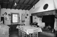<br><small>Kitchen</small></td>
<td bgcolor=LightCoral><br><small>Office</small></td>
<td bgcolor=#FFBB55><br><small>TallBuilding</small></td>
<td bgcolor=#FFBB55><br><small>Street</small></td>
</tr>
<tr>
<td>Office</td>
<td>0.900</td>
<td bgcolor=LightBlue></td>
<td bgcolor=LightBlue></td>
<td bgcolor=LightGreen></td>
<td bgcolor=LightGreen></td>
<td bgcolor=LightCoral><br><small>InsideCity</small></td>
<td bgcolor=LightCoral><br><small>LivingRoom</small></td>
<td bgcolor=#FFBB55><br><small>TallBuilding</small></td>
<td bgcolor=#FFBB55><br><small>Bedroom</small></td>
</tr>
<tr>
<td>Industrial</td>
<td>0.400</td>
<td bgcolor=LightBlue></td>
<td bgcolor=LightBlue></td>
<td bgcolor=LightGreen></td>
<td bgcolor=LightGreen></td>
<td bgcolor=LightCoral><br><small>Forest</small></td>
<td bgcolor=LightCoral><br><small>OpenCountry</small></td>
<td bgcolor=#FFBB55><br><small>TallBuilding</small></td>
<td bgcolor=#FFBB55><br><small>Mountain</small></td>
</tr>
<tr>
<td>Suburb</td>
<td>0.960</td>
<td bgcolor=LightBlue></td>
<td bgcolor=LightBlue></td>
<td bgcolor=LightGreen></td>
<td bgcolor=LightGreen>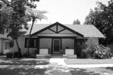</td>
<td bgcolor=LightCoral><br><small>Industrial</small></td>
<td bgcolor=LightCoral><br><small>Industrial</small></td>
<td bgcolor=#FFBB55><br><small>Coast</small></td>
<td bgcolor=#FFBB55><br><small>Coast</small></td>
</tr>
<tr>
<td>InsideCity</td>
<td>0.470</td>
<td bgcolor=LightBlue></td>
<td bgcolor=LightBlue></td>
<td bgcolor=LightGreen></td>
<td bgcolor=LightGreen></td>
<td bgcolor=LightCoral><br><small>Store</small></td>
<td bgcolor=LightCoral><br><small>OpenCountry</small></td>
<td bgcolor=#FFBB55><br><small>Highway</small></td>
<td bgcolor=#FFBB55><br><small>TallBuilding</small></td>
</tr>
<tr>
<td>TallBuilding</td>
<td>0.690</td>
<td bgcolor=LightBlue></td>
<td bgcolor=LightBlue></td>
<td bgcolor=LightGreen></td>
<td bgcolor=LightGreen></td>
<td bgcolor=LightCoral><br><small>Store</small></td>
<td bgcolor=LightCoral><br><small>Industrial</small></td>
<td bgcolor=#FFBB55><br><small>Street</small></td>
<td bgcolor=#FFBB55><br><small>Mountain</small></td>
</tr>
<tr>
<td>Street</td>
<td>0.540</td>
<td bgcolor=LightBlue></td>
<td bgcolor=LightBlue></td>
<td bgcolor=LightGreen></td>
<td bgcolor=LightGreen></td>
<td bgcolor=LightCoral><br><small>LivingRoom</small></td>
<td bgcolor=LightCoral><br><small>LivingRoom</small></td>
<td bgcolor=#FFBB55><br><small>Highway</small></td>
<td bgcolor=#FFBB55><br><small>TallBuilding</small></td>
</tr>
<tr>
<td>Highway</td>
<td>0.820</td>
<td bgcolor=LightBlue></td>
<td bgcolor=LightBlue></td>
<td bgcolor=LightGreen></td>
<td bgcolor=LightGreen></td>
<td bgcolor=LightCoral><br><small>Street</small></td>
<td bgcolor=LightCoral><br><small>Coast</small></td>
<td bgcolor=#FFBB55><br><small>Bedroom</small></td>
<td bgcolor=#FFBB55><br><small>Coast</small></td>
</tr>
<tr>
<td>OpenCountry</td>
<td>0.380</td>
<td bgcolor=LightBlue></td>
<td bgcolor=LightBlue></td>
<td bgcolor=LightGreen></td>
<td bgcolor=LightGreen></td>
<td bgcolor=LightCoral><br><small>Highway</small></td>
<td bgcolor=LightCoral><br><small>TallBuilding</small></td>
<td bgcolor=#FFBB55>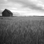<br><small>Bedroom</small></td>
<td bgcolor=#FFBB55><br><small>Coast</small></td>
</tr>
<tr>
<td>Coast</td>
<td>0.810</td>
<td bgcolor=LightBlue></td>
<td bgcolor=LightBlue></td>
<td bgcolor=LightGreen></td>
<td bgcolor=LightGreen></td>
<td bgcolor=LightCoral><br><small>Highway</small></td>
<td bgcolor=LightCoral><br><small>OpenCountry</small></td>
<td bgcolor=#FFBB55><br><small>Mountain</small></td>
<td bgcolor=#FFBB55><br><small>Suburb</small></td>
</tr>
<tr>
<td>Mountain</td>
<td>0.810</td>
<td bgcolor=LightBlue></td>
<td bgcolor=LightBlue></td>
<td bgcolor=LightGreen></td>
<td bgcolor=LightGreen></td>
<td bgcolor=LightCoral>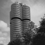<br><small>TallBuilding</small></td>
<td bgcolor=LightCoral><br><small>TallBuilding</small></td>
<td bgcolor=#FFBB55><br><small>Street</small></td>
<td bgcolor=#FFBB55><br><small>Suburb</small></td>
</tr>
<tr>
<td>Forest</td>
<td>0.890</td>
<td bgcolor=LightBlue></td>
<td bgcolor=LightBlue></td>
<td bgcolor=LightGreen></td>
<td bgcolor=LightGreen></td>
<td bgcolor=LightCoral><br><small>TallBuilding</small></td>
<td bgcolor=LightCoral><br><small>OpenCountry</small></td>
<td bgcolor=#FFBB55><br><small>Mountain</small></td>
<td bgcolor=#FFBB55><br><small>Mountain</small></td>
</tr>
<tr>
<th>Category name</th>
<th>Accuracy</th>
<th colspan=2>Sample training images</th>
<th colspan=2>Sample true positives</th>
<th colspan=2>False positives with true label</th>
<th colspan=2>False negatives with wrong predicted label</th>
</tr>
</table>
</center>

<center>
<h1>Bag of SIFT representation and Non-linear SVM classifier (LibSVM with RBF kernel)</h1>


<br>
Accuracy (mean of diagonal of confusion matrix) is 0.615
<p>

<table border=0 cellpadding=4 cellspacing=1>
<tr>
<th>Category name</th>
<th>Accuracy</th>
<th colspan=2>Sample training images</th>
<th colspan=2>Sample true positives</th>
<th colspan=2>False positives with true label</th>
<th colspan=2>False negatives with wrong predicted label</th>
</tr>
<tr>
<td>Kitchen</td>
<td>0.540</td>
<td bgcolor=LightBlue>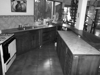</td>
<td bgcolor=LightBlue>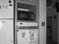</td>
<td bgcolor=LightGreen>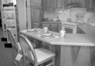</td>
<td bgcolor=LightGreen>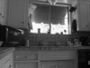</td>
<td bgcolor=LightCoral><br><small>Office</small></td>
<td bgcolor=LightCoral><br><small>Office</small></td>
<td bgcolor=#FFBB55>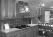<br><small>Street</small></td>
<td bgcolor=#FFBB55>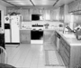<br><small>InsideCity</small></td>
</tr>
<tr>
<td>Store</td>
<td>0.490</td>
<td bgcolor=LightBlue>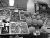</td>
<td bgcolor=LightBlue></td>
<td bgcolor=LightGreen></td>
<td bgcolor=LightGreen></td>
<td bgcolor=LightCoral><br><small>TallBuilding</small></td>
<td bgcolor=LightCoral><br><small>Industrial</small></td>
<td bgcolor=#FFBB55><br><small>Highway</small></td>
<td bgcolor=#FFBB55><br><small>InsideCity</small></td>
</tr>
<tr>
<td>Bedroom</td>
<td>0.360</td>
<td bgcolor=LightBlue></td>
<td bgcolor=LightBlue></td>
<td bgcolor=LightGreen>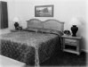</td>
<td bgcolor=LightGreen>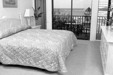</td>
<td bgcolor=LightCoral><br><small>Store</small></td>
<td bgcolor=LightCoral><br><small>InsideCity</small></td>
<td bgcolor=#FFBB55>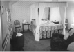<br><small>Store</small></td>
<td bgcolor=#FFBB55><br><small>LivingRoom</small></td>
</tr>
<tr>
<td>LivingRoom</td>
<td>0.340</td>
<td bgcolor=LightBlue>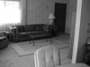</td>
<td bgcolor=LightBlue></td>
<td bgcolor=LightGreen>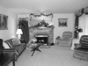</td>
<td bgcolor=LightGreen>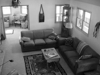</td>
<td bgcolor=LightCoral><br><small>Bedroom</small></td>
<td bgcolor=LightCoral><br><small>Office</small></td>
<td bgcolor=#FFBB55>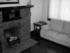<br><small>Bedroom</small></td>
<td bgcolor=#FFBB55>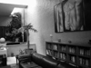<br><small>Industrial</small></td>
</tr>
<tr>
<td>Office</td>
<td>0.750</td>
<td bgcolor=LightBlue></td>
<td bgcolor=LightBlue></td>
<td bgcolor=LightGreen></td>
<td bgcolor=LightGreen></td>
<td bgcolor=LightCoral>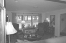<br><small>LivingRoom</small></td>
<td bgcolor=LightCoral>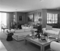<br><small>LivingRoom</small></td>
<td bgcolor=#FFBB55>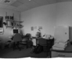<br><small>Bedroom</small></td>
<td bgcolor=#FFBB55><br><small>Kitchen</small></td>
</tr>
<tr>
<td>Industrial</td>
<td>0.470</td>
<td bgcolor=LightBlue></td>
<td bgcolor=LightBlue></td>
<td bgcolor=LightGreen></td>
<td bgcolor=LightGreen></td>
<td bgcolor=LightCoral><br><small>Street</small></td>
<td bgcolor=LightCoral><br><small>LivingRoom</small></td>
<td bgcolor=#FFBB55><br><small>Store</small></td>
<td bgcolor=#FFBB55><br><small>LivingRoom</small></td>
</tr>
<tr>
<td>Suburb</td>
<td>0.920</td>
<td bgcolor=LightBlue>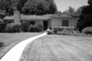</td>
<td bgcolor=LightBlue>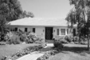</td>
<td bgcolor=LightGreen>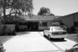</td>
<td bgcolor=LightGreen>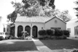</td>
<td bgcolor=LightCoral><br><small>OpenCountry</small></td>
<td bgcolor=LightCoral><br><small>OpenCountry</small></td>
<td bgcolor=#FFBB55>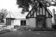<br><small>Industrial</small></td>
<td bgcolor=#FFBB55><br><small>Bedroom</small></td>
</tr>
<tr>
<td>InsideCity</td>
<td>0.500</td>
<td bgcolor=LightBlue></td>
<td bgcolor=LightBlue></td>
<td bgcolor=LightGreen></td>
<td bgcolor=LightGreen></td>
<td bgcolor=LightCoral><br><small>Industrial</small></td>
<td bgcolor=LightCoral><br><small>TallBuilding</small></td>
<td bgcolor=#FFBB55><br><small>Store</small></td>
<td bgcolor=#FFBB55><br><small>TallBuilding</small></td>
</tr>
<tr>
<td>TallBuilding</td>
<td>0.570</td>
<td bgcolor=LightBlue></td>
<td bgcolor=LightBlue></td>
<td bgcolor=LightGreen></td>
<td bgcolor=LightGreen></td>
<td bgcolor=LightCoral>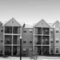<br><small>InsideCity</small></td>
<td bgcolor=LightCoral><br><small>InsideCity</small></td>
<td bgcolor=#FFBB55><br><small>Store</small></td>
<td bgcolor=#FFBB55><br><small>Mountain</small></td>
</tr>
<tr>
<td>Street</td>
<td>0.610</td>
<td bgcolor=LightBlue></td>
<td bgcolor=LightBlue>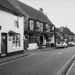</td>
<td bgcolor=LightGreen></td>
<td bgcolor=LightGreen></td>
<td bgcolor=LightCoral><br><small>Store</small></td>
<td bgcolor=LightCoral><br><small>OpenCountry</small></td>
<td bgcolor=#FFBB55>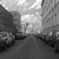<br><small>Store</small></td>
<td bgcolor=#FFBB55><br><small>Industrial</small></td>
</tr>
<tr>
<td>Highway</td>
<td>0.820</td>
<td bgcolor=LightBlue></td>
<td bgcolor=LightBlue></td>
<td bgcolor=LightGreen></td>
<td bgcolor=LightGreen></td>
<td bgcolor=LightCoral><br><small>Industrial</small></td>
<td bgcolor=LightCoral>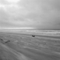<br><small>Coast</small></td>
<td bgcolor=#FFBB55><br><small>LivingRoom</small></td>
<td bgcolor=#FFBB55><br><small>Street</small></td>
</tr>
<tr>
<td>OpenCountry</td>
<td>0.530</td>
<td bgcolor=LightBlue>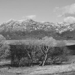</td>
<td bgcolor=LightBlue></td>
<td bgcolor=LightGreen>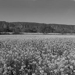</td>
<td bgcolor=LightGreen></td>
<td bgcolor=LightCoral>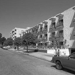<br><small>Street</small></td>
<td bgcolor=LightCoral>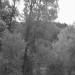<br><small>Forest</small></td>
<td bgcolor=#FFBB55><br><small>TallBuilding</small></td>
<td bgcolor=#FFBB55><br><small>Highway</small></td>
</tr>
<tr>
<td>Coast</td>
<td>0.710</td>
<td bgcolor=LightBlue></td>
<td bgcolor=LightBlue></td>
<td bgcolor=LightGreen></td>
<td bgcolor=LightGreen></td>
<td bgcolor=LightCoral><br><small>Highway</small></td>
<td bgcolor=LightCoral><br><small>Mountain</small></td>
<td bgcolor=#FFBB55><br><small>OpenCountry</small></td>
<td bgcolor=#FFBB55><br><small>InsideCity</small></td>
</tr>
<tr>
<td>Mountain</td>
<td>0.730</td>
<td bgcolor=LightBlue></td>
<td bgcolor=LightBlue></td>
<td bgcolor=LightGreen></td>
<td bgcolor=LightGreen></td>
<td bgcolor=LightCoral><br><small>Bedroom</small></td>
<td bgcolor=LightCoral><br><small>OpenCountry</small></td>
<td bgcolor=#FFBB55><br><small>Suburb</small></td>
<td bgcolor=#FFBB55><br><small>Suburb</small></td>
</tr>
<tr>
<td>Forest</td>
<td>0.890</td>
<td bgcolor=LightBlue></td>
<td bgcolor=LightBlue></td>
<td bgcolor=LightGreen></td>
<td bgcolor=LightGreen></td>
<td bgcolor=LightCoral><br><small>Mountain</small></td>
<td bgcolor=LightCoral><br><small>OpenCountry</small></td>
<td bgcolor=#FFBB55><br><small>Mountain</small></td>
<td bgcolor=#FFBB55><br><small>OpenCountry</small></td>
</tr>
<tr>
<th>Category name</th>
<th>Accuracy</th>
<th colspan=2>Sample training images</th>
<th colspan=2>Sample true positives</th>
<th colspan=2>False positives with true label</th>
<th colspan=2>False negatives with wrong predicted label</th>
</tr>
</table>
</center>
